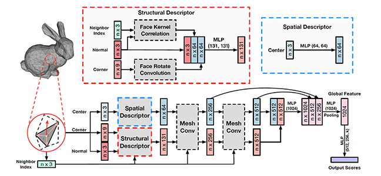

## MeshNet: Mesh Neural Network for 3D Shape Representation

Pytorch Implementation

## Dataset
[Dataset ModelNet10](https://drive.google.com/file/d/1zZa1ttXVHLODY8fAeF23U22EzJm7OdR5/view?usp=sharing) are both public and easily available.
[Modified Dataset](https://drive.google.com/drive/folders/1KV5rmJhWO3YuVi2VfmETeXan4ZfZKHoc)

## Using the code
You are free to use contents of this repo for academic and non-commercial purposes only.

## Resources
Implementation of [Mesh Neural Network research Paper](https://arxiv.org/pdf/1811.11424v1.pdf)

## Task
Classifying 3D objects into 10 classes(or 40 depending on dataset used). MeshData is received and corresponding class is the output.

## Dataset pre-processing
Dataset containing .off files first converted to .stl files in convert.py file. Then input.py extracts the required data in mesh format.  

## Model Architecture
Model.py contains the full model architecture. The architecture is designed to capture and combine both spatial and structural features of 3d models and thus tacke irregularities in 3d data. 
Architecture is as follows:



### Note : All images have been taken from the mentioned papers.

### Reference:
```bibtex
@inproceedings{feng2019meshnet,
  title={MeshNet: Mesh neural network for 3D shape representation},
  author={Feng, Yutong and Feng, Yifan and You, Haoxuan and Zhao, Xibin and Gao, Yue},
  booktitle={Proceedings of the AAAI Conference on Artificial Intelligence},
  volume={33},
  pages={8279--8286},
  year={2019}
}
```
